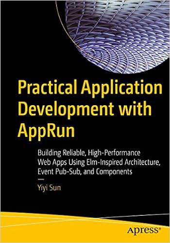

# AppRun 

[](https://apprun.js.org/docs)
[](https://apprun.js.org/#play)
[![NPM version][npm-image]][npm-url] [![Downloads][downloads-image]][downloads-url] [![License][license-image]][license-url] [![twitter][twitter-badge]][twitter] [![Discord Chat][discord-image]][discord-invite]

🚀 July 2025, We have started to improve the codebase using AI. See [whats new](#new) for details.

## Introduction

AppRun is a lightweight framework for building web apps. It has a [unique architecture](https://apprun.js.org/docs/architecture/) inspired by the Elm architecture that can help you manage states, routing, and other essential aspects of your web application, leveraging the power of the [event publish-subscribe](https://apprun.js.org/docs/event-pubsub/) pattern.

## AppRun Benefits

* Clean architecture that needs minimal setup and boilerplate code.
* Decoupled architecture that is test friendly.
* No proprietary syntax to learn (no hooks, no reducers, no signals)
* State management and routing included
* Use directly in the browser or with a compiler/bundler
* Advanced features: JSX, Web Components, Dev Tools, SSR, etc.

## Examples

Let's use a _Counter_ as an example to demonstrate the AppRun architecture:

```js
// define the initial state
const state = 0;

// view is a function to display the state (JSX)
const view = state => <div>
  <h1>{state}</h1>
  <button onclick="app.run('-1')">-1</button>
  <button onclick="app.run('+1')">+1</button>
</div>;

// update is a collection of event handlers
const update = {
  '+1': state => state + 1,
  '-1': state => state - 1
};

// start the app
app.start(document.body, state, view, update);
```
<apprun-code></apprun-code>

With [directives](https://apprun.js.org/docs/directives/) syntax sugar you can write more concise code:

```js
// define the initial state
const state = 0;

// view is a function to display the state (JSX)
const view = state => <div>
  <h1>{state}</h1>
  <button $onclick="-1">-1</button>
  <button $onclick="+1">+1</button>
</div>;

// update is a collection of event handlers
const update = {
  '+1': state => state + 1,
  '-1': state => state - 1
};

// start the app
app.start(document.body, state, view, update);
```
<apprun-code></apprun-code>

Alternatively, you can invoke state update functions without events for local state updates:

```js
// define the initial state
const state = 0;

// state update function
const add = (state, value) => state + value;

// view is a function to display the state (JSX)
const view = state => <div>
  <h1>{state}</h1>
  <button $onclick={[add, -1]}>-1</button>
  <button $onclick={[add, 1]}>+1</button>
</div>;

// start the app
app.start(document.body, state, view);
```
<apprun-code></apprun-code>

And, of course, you can use Components to encapsulate the logic blocks, e.g., SPA pages. AppRun supports routing to `/<path>`, `#<path>`, and `#/<path>` URLs with [hierarchical routing](docs/requirements/req-hierarchical-routing.md).

```js
class Home extends Component {
  view = () => <div>Home</div>;
}

class Contact extends Component {
  view = () => <div>Contact</div>;
}

class About extends Component {
  view = () => <div>About</div>;
}

const App = () => <>
  <div id="menus">
    <a href="/home">Home</a>{' | '}
    <a href="/contact">Contact</a>{' | '}
    <a href="/about">About</a></div>
  <div id="pages"></div>
</>

app.render(document.body, <App />);
[
  [About, '/about'],
  [Contact, '/contact'],
  [Home, '/, /home'],
].map(([C, route]) => new C().start('pages', {route}));
```
<apprun-code></apprun-code>


One cool feature of AppRun is that you can use async generator functions for event handlers to return multiple values. AppRun will render each value in the order they are generated.

```js
const state = {};
const view = state => html`
  <div><button @click=${run(getComic)}>fetch ...</button></div>
  ${state.loading && html`<div>loading ... </div>`}
  ${state.comic && html``}
`;
async function* getComic() {  // async generator function returns loading flag and then the comic object
  yield { loading: true };
  const response = await fetch('https://xkcd-api.netlify.app');
  const comic = await response.json();
  yield { comic };
}

app.start(document.body, state, view);
```
<apprun-code></apprun-code>

Finally, you can use AppRun with [React](https://reactjs.org/). The `app.use_react` function allows you to use React for rendering the view.

```js
import React from 'react'
import ReactDOM from 'react-dom/client'
import app from 'apprun';
use_react(React, ReactDOM);
```

The `app.use_render` function allows you to use a other render library for rendering the view.

```js
import { render } from 'preact'
import app from 'apprun';
app.use_render(render);
```

There are many more examples and interactive demos available in [the AppRun Playground](https://apprun.js.org/#play).


## Getting Started

AppRun is distributed on npm. To get it, run:

```sh
npm install apprun
```

When you want to do a rapid prototyping or demo, you can use AppRun directly in the browser without JSX or any build step. The `app`, `html` and `run` functions are available globally. The `html` is a HTML template from lit-html. The `run` function is a equivalent to the `$on` directive, which can be used to invoke state update functions.

```js
<html>
<body>
<script src="https://unpkg.com/apprun/dist/apprun-html.js"></script>
<script>
  const view = state => `<div>${state}</div>`;
  app.start(document.body, 'hello AppRun', view);
</script>
</body>
</html>
```
<apprun-code style="height:200px"></apprun-code>

Or, use the ESM version:
```js
<html>
<body>
<script type="module">
  import { app, html } from 'https://unpkg.com/apprun/dist/apprun-html.esm.js';
  const view = state => html`<div>${state}</div>`;
  app.start(document.body, 'hello ESM', view);
</script>
</body>
</html>
```
<apprun-code style="height:200px"></apprun-code>

In addition to run directly in the browser,  or with a compiler/bundler like Webpack or Vite.

You can run the `npm create apprun-app` command to create an AppRun project.

```sh
npm create apprun-app [my-app]
```

### Learn More

You can read [AppRun Docs](https://apprun.js.org/docs).

### AppRun Book from Apress

[](https://www.amazon.com/Practical-Application-Development-AppRun-High-Performance/dp/1484240685/)

* [Order from Amazon](https://www.amazon.com/Practical-Application-Development-AppRun-High-Performance/dp/1484240685/)


## Contribute

You can launch the webpack dev-server and the demo app from the _demo_ folder with the following npm commands:
```sh
npm install
npm start
```

You can run the unit tests from the _tests_ folder.
```sh
npm test
```
Unit tests can serve as functional specifications.

Finally, to build optimized js files to the dist folder, just run:
```sh
npm run build
```

Have fun and send pull requests.

## Contributors
[](https://github.com/yysun/apprun/graphs/contributors)

## Support

AppRun is an MIT-licensed open-source project. Please consider [supporting the project on Patreon](https://www.patreon.com/apprun). 👍❤️🙏

### Thank you for your support

* Athkahden Asura
* Alfred Nerstu
* Gyuri Lajos
* Lorenz Glißmann
* Kevin Shi
* Chancy Kennedy

## License

MIT

Copyright (c) 2015-2025 Yiyi Sun


[travis-image]: https://travis-ci.org/yysun/apprun.svg?branch=master
[travis-url]: https://travis-ci.org/yysun/apprun
[npm-image]: https://img.shields.io/npm/v/apprun.svg
[npm-url]: https://npmjs.org/package/apprun
[license-image]: https://img.shields.io/:license-mit-blue.svg
[license-url]: LICENSE.md
[downloads-image]: https://img.shields.io/npm/dm/apprun.svg
[downloads-url]: https://npmjs.org/package/apprun

[twitter]: https://twitter.com/intent/tweet?text=Check%20out%20AppRun%20by%20%40yysun%20https%3A%2F%2Fgithub.com%2Fyysun%2Fapprun%20%F0%9F%91%8D%20%40apprunjs
[twitter-badge]: https://img.shields.io/twitter/url/https/github.com/yysun/apprun.svg?style=social

[discord-image]: https://img.shields.io/discord/476903999023480842.svg
[discord-invite]: https://discord.gg/CETyUdx