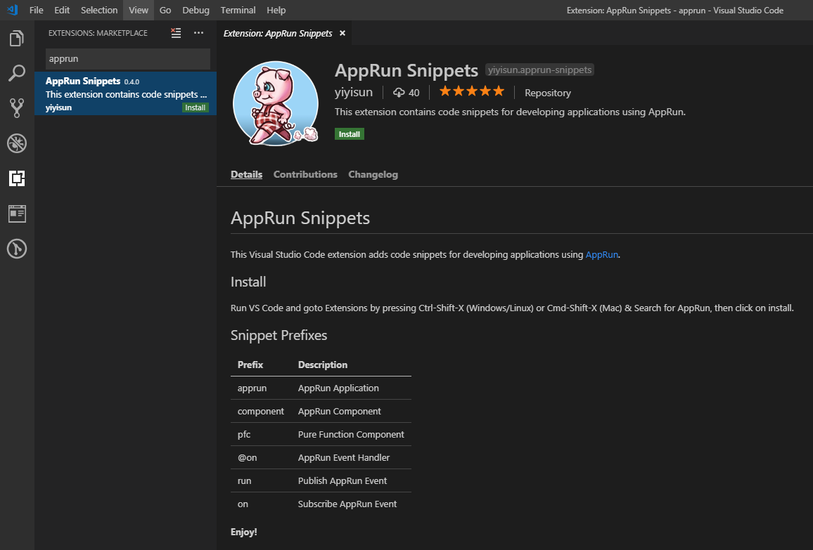

# AppRun [![Build][travis-image]][travis-url] [![NPM version][npm-image]][npm-url] [![Downloads][downloads-image]][downloads-url] [![License][license-image]][license-url] [![twitter][twitter-badge]][twitter] [![Discord Chat][discord-image]][discord-invite]

AppRun is a Javascript library for building reliable, high-performance web applications using the Elm inspired Architecture, events, and components.

> AppRun is a MIT-licensed open source project. Please consider [supporting the project on Patreon](https://www.patreon.com/apprun). 👍❤️🙏

## AppRun Benefits

* Write less code
* No proprietary syntax to learn
* Compiler/transpiler is optional
* State management and routing included
* Run side-by-side with jQuery, chartjs, D3, lit-html ...

Applications built with AppRun have **less lines of code**, **smaller js files**, and **better performance**. See a comparison from [A Real-World Comparison of Front-End Frameworks with Benchmarks (2019 update)](https://medium.freecodecamp.org/a-realworld-comparison-of-front-end-frameworks-with-benchmarks-2019-update-4be0d3c78075). You can also see the [performance results](https://rawgit.com/krausest/js-framework-benchmark/master/webdriver-ts-results/table.html) compared to other frameworks and libraries in the [js-framework-benchmark](https://github.com/krausest/js-framework-benchmark) project.

## AppRun Book from Apress

[](https://www.amazon.com/Practical-Application-Development-AppRun-High-Performance/dp/1484240685/)

* [Order from Amazon](https://www.amazon.com/Practical-Application-Development-AppRun-High-Performance/dp/1484240685/)


## Architecture Concept

Application logic is broken down into three separated parts in the AppRun architecture.

* State (a.k.a. Model) — the state of your application
* View — a function to display the state
* Update — a collection of event handlers to update the state

AppRun ties the three parts together and drives the applications.

## Quick Start

### AppRun Playground

Try the [AppRun Playground](https://apprun.js.org/#play).


### Use AppRun in Browsers

You can include AppRun in your html directly and use it with JavaScript.
```javascript
<script src="https://unpkg.com/apprun@latest/dist/apprun-html.js"></script>
```

Below is a counter application using AppRun ([Online Demo](https://apprun.js.org/#play/6)).
```html
<html>
<head>
  <meta charset="utf-8">
  <title>Counter</title>
</head>
<body>
  <script src="https://unpkg.com/apprun@latest/dist/apprun-html.js"></script>
  <div id="my-app"></div>
  <script>
    const state = 0;
    const view = state => {
      return `<div>
        <h1>${state}</h1>
        <button onclick='app.run("-1")'>-1</button>
        <button onclick='app.run("+1")'>+1</button>
      </div>`;
    };
    const update = {
      '+1': state => state + 1,
      '-1': state => state - 1
    };
    app.start('my-app', state, view, update);
  </script>
</body>
</html>
```

### Use TypeScript and Webpack

You can use AppRun with TypeScript and Webpack. Use the AppRun CLI to initialize a TypeScript and webpack configured project:
```sh
npx apprun --init --spa
npm start
```
To initialize a project that targets ES6/ES2015, use the AppRun CLI with the --es6 flag:
```sh
npx apprun --init --spa --es6
npm start
```

## AppRun Site Framework

[AppRun Site](https://github.com/yysun/apprun-site) is an framework for building AppRun applications. It has the following features:

* Progressive Web App (PWA) - support offline
* Single Page App (SPA) - routing using / or #
* 4 built-in layouts and bring your own
* Compile html, markdown pages to AppRun components
* Auto generate the index of pages
* Build app logic using AppRun/Web components
* Targets ES5 or ES Module

Please visit [AppRun Site Documentations](https://yysun.github.io/apprun-site).


## Developer Tools

### CLI in Console

AppRun CLI also runs in console.


To use the AppRun dev-tools CLI, include the the dev-tools script.

```JavaScript
<script src="https://unpkg.com/apprun@latest/dist/apprun-dev-tools.js"></script>
```

### Dev-Tools Extensions

AppRun support the Redux DevTools Extension. To use the dev-tools, install the [Redux DevTools Extension](https://github.com/zalmoxisus/redux-devtools-extension). You can monitor the events and states in the devtools.


### VS Code Extension

AppRun has a code snippet extension for VS Code that you can install from the extension marketplace. It inserts AppRun code template for application, component and event handling.




## Contribute

You can launch the webpack dev-server and the demo app from the _demo_ folder with the following npm commands:
```sh
npm install
npm start
```

You can run the unit tests from the _tests_ folder.
```sh
npm test
```
Unit tests can serve as functional specifications.

Finally, to build optimized js files to the dist folder, just run:
```sh
npm run build
```

Have fun and send pull requests.

## License

MIT

Copyright (c) 2015-2019 Yiyi Sun


[travis-image]: https://travis-ci.org/yysun/apprun.svg?branch=master
[travis-url]: https://travis-ci.org/yysun/apprun
[npm-image]: https://img.shields.io/npm/v/apprun.svg
[npm-url]: https://npmjs.org/package/apprun
[license-image]: https://img.shields.io/:license-mit-blue.svg
[license-url]: LICENSE.md
[downloads-image]: http://img.shields.io/npm/dm/apprun.svg
[downloads-url]: https://npmjs.org/package/apprun

[twitter]: https://twitter.com/intent/tweet?text=Check%20out%20AppRun%20by%20%40yysun%20https%3A%2F%2Fgithub.com%2Fyysun%2Fapprun%20%F0%9F%91%8D%20%40apprunjs
[twitter-badge]: https://img.shields.io/twitter/url/https/github.com/yysun/apprun.svg?style=social

[discord-image]: https://img.shields.io/discord/476903999023480842.svg
[discord-invite]: https://discord.gg/M5EDsj