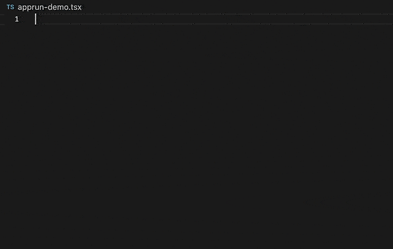

# AppRun [![Build][travis-image]][travis-url] [![NPM version][npm-image]][npm-url] [![Downloads][downloads-image]][downloads-url] [![License][license-image]][license-url] [![twitter][twitter-badge]][twitter] [![Discord Chat][discord-image]][discord-invite]

AppRun is a JavaScript library for building reliable, high-performance web applications using the Elm inspired architecture, events, and components.

> AppRun is an MIT-licensed open source project. Please consider [supporting the project on Patreon](https://www.patreon.com/apprun). 👍❤️🙏

## AppRun Benefits

* Write less code
* No proprietary syntax to learn
* Compiler/transpiler is optional
* State management and routing included
* Run side-by-side with jQuery, chartjs, D3, lit-html ...

AppRun is distributed on npm.
```sh
npm install apprun
```

You can also load AppRun directly from the unpkg.com CDN:

```javascript
<script src="https://unpkg.com/apprun/dist/apprun-html.js"></script>
```
Or use it as ES module from unpkg.com:
```javascript
<script type="module">
  import { app, Component } from 'https://unpkg.com/apprun@next/esm/apprun-html?module';
</script>
```
## Architecture Concept



* AppRun architecure has _state_, _view_, and _update_.
* AppRun is event-driven.
* AppRun is [Component](docs/#/05-component) based.

[Try the AppRun Playground](https://apprun.js.org/#play).

## AppRun Book from Apress

[](https://www.amazon.com/Practical-Application-Development-AppRun-High-Performance/dp/1484240685/)

* [Order from Amazon](https://www.amazon.com/Practical-Application-Development-AppRun-High-Performance/dp/1484240685/)

## Create AppRun Apps

Use the AppRun CLI to initialize a TypeScript and webpack configured project:

```sh
npx apprun --init --spa
```

To initialize a project that targets ES5, use the AppRun CLI with the --es5 flag:

```sh
npx apprun --init --spa --es5
```

## AppRun Dev Server

AppRun now has a dev server. It is base on the _live-server_ and supports ES Modules.

To use the AppRun dev server:

```sh
npx apprun-dev-server
```

See the annoucement: [A Dev Server Supports ESM](https://dev.to/yysun/a-dev-server-supports-esm-3cea)

To use the AppRun dev-tools, include the dev-tools script.

```JavaScript
<script src="https://unpkg.com/apprun/dist/apprun-dev-tools.js"></script>
```

See the annoucement: [AppRun Dev Tools](https://dev.to/yysun/make-cli-run-in-the-console-42ho)

AppRun Dev Tools connects to the Redux DevTools Extension. To use the dev-tools, install the [Redux DevTools Extension](https://github.com/zalmoxisus/redux-devtools-extension). You can monitor the events and states.


## Contribute

You can launch the webpack dev-server and the demo app from the _demo_ folder with the following npm commands:
```sh
npm install
npm start
```

You can run the unit tests from the _tests_ folder.
```sh
npm test
```
Unit tests can serve as functional specifications.

Finally, to build optimized js files to the dist folder, just run:
```sh
npm run build
```

Have fun and send pull requests.

## Contributors
[](https://github.com/yysun/apprun/graphs/contributors)

## License

MIT

Copyright (c) 2015-2020 Yiyi Sun


[travis-image]: https://travis-ci.org/yysun/apprun.svg?branch=master
[travis-url]: https://travis-ci.org/yysun/apprun
[npm-image]: https://img.shields.io/npm/v/apprun.svg
[npm-url]: https://npmjs.org/package/apprun
[license-image]: https://img.shields.io/:license-mit-blue.svg
[license-url]: LICENSE.md
[downloads-image]: http://img.shields.io/npm/dm/apprun.svg
[downloads-url]: https://npmjs.org/package/apprun

[twitter]: https://twitter.com/intent/tweet?text=Check%20out%20AppRun%20by%20%40yysun%20https%3A%2F%2Fgithub.com%2Fyysun%2Fapprun%20%F0%9F%91%8D%20%40apprunjs
[twitter-badge]: https://img.shields.io/twitter/url/https/github.com/yysun/apprun.svg?style=social

[discord-image]: https://img.shields.io/discord/476903999023480842.svg
[discord-invite]: https://discord.gg/M5EDsj