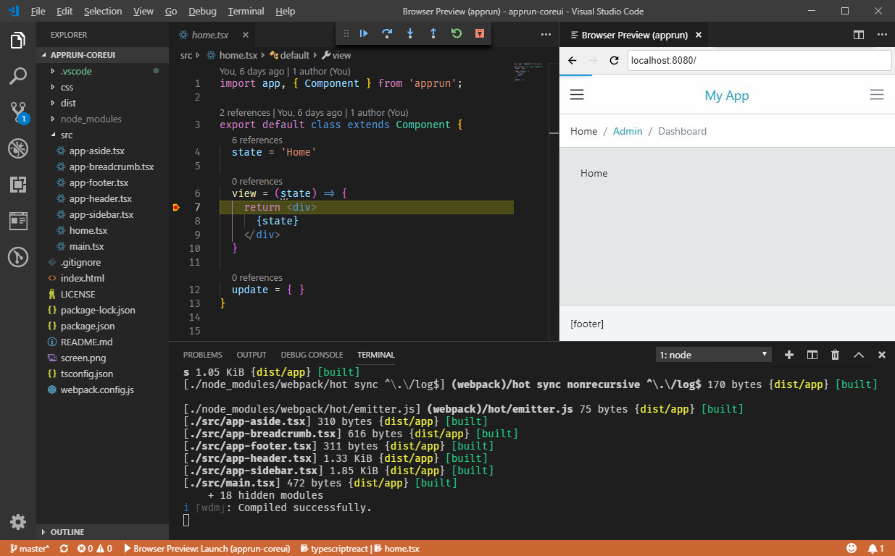

# Tutorial

## Create Your First App

The easiest way is to include AppRun in the HTML file. Let's use the counter app below as an example.

```html
<html>
<head>
  <meta charset="utf-8">
  <title>Counter</title>
</head>
<body>
  <script src="https://unpkg.com/apprun@latest/dist/apprun-html.js"></script>
  <div id="my-app"></div>
  <script>
    const state = 0;
    const view = state => {
      return `<div>
        <h1>${state}</h1>
        <button onclick='app.run("-1")'>-1</button>
        <button onclick='app.run("+1")'>+1</button>
      </div>`;
    };
    const update = {
      '+1': state => state + 1,
      '-1': state => state - 1
    };
    app.start('my-app', state, view, update);
  </script>
</body>
</html>
```

You can save and run the HTML above locally or use the following online editors.


## Online Editor

### AppRun Playground
* [AppRun Playground](https://apprun.js.org/#play)

### glitch
* [glitch](https://glitch.com/~apprun-counter).

### repl.it
* [repl.it](https://repl.it/@yysun/apprun-counter)

### jsfiddle
* [jsfiddle](https://jsfiddle.net/ap1kgyeb/4)

```
```

## Dev Environment

For real world application development, you can use the AppRun CLI to create a TypeScript and webpack configured project. You will get a productive development environment in Visual Studio Code.

```sh
npx apprun --init
```




Next, you will see with a set of [Dev Tools](03-dev-tools) that can help you developing.