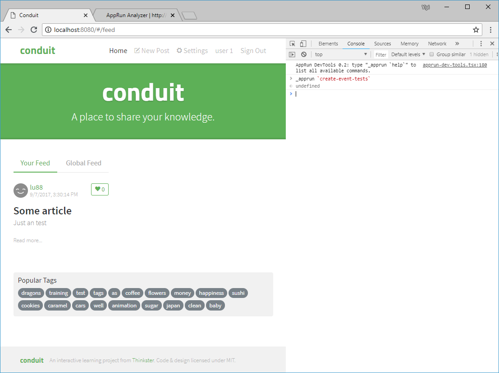
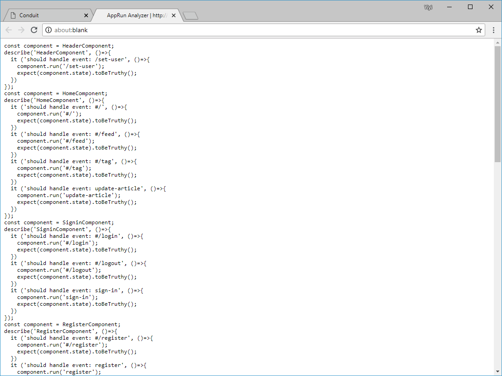
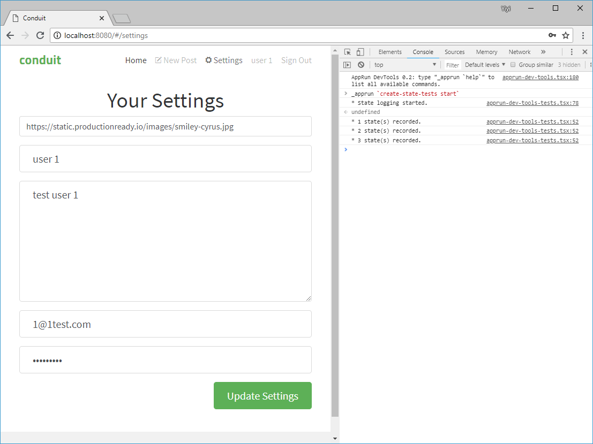
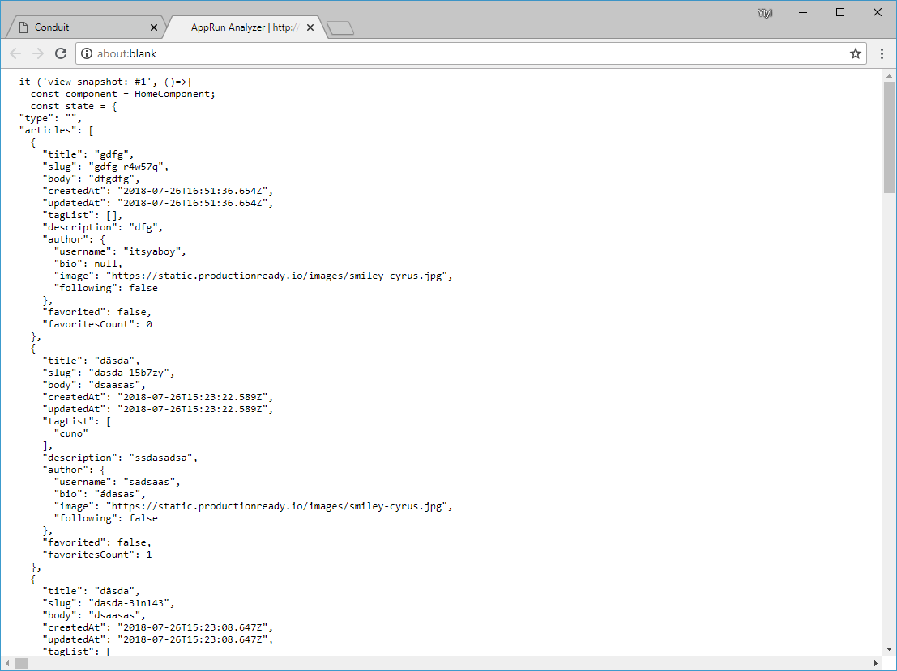

# Unit Testing

AppRun architecture is unit test-oriented. The three-architectural parts _state_, _view_ and _update_ (event handlers) are decoupled. They are very easy to test.

AppRun development environment includes the Jest framework . The convention to run the tests is to use the npm script:
```sh
npm run jest
```
We can also runt the Jest testing interactive mode using the npm script:
```sh
npm test
```
Jest watches file changes and runs the test files only related to changed files. Jest also execute the tests in parallel. It is very fast to execute the tests. The interactive way for us to define which tests to be executed during the watch mode.

## Types of Testing

There are two types of unit tests in AppRun application.

1. Test the _events-states_ - publishing the events and asset the states.
2. Test the _state-vdom_ - set the states and asset the VDOM output of the _view_ function.

## Create Tests using CLI

Creating unit tests could be tedious, but you can use the [AppRun CLI in Console](03-dev-tools) to generate the tests.

First, include the two CLI scripts in your HTML.

```html
<script src="https://unpkg.com/apprun@latest/dist/apprun-dev-tools.js"></script>
<script src="https://unpkg.com/apprun@latest/dist/apprun-dev-tools-tests.js"></script>
```

### Event-State Tests

Use the _**create-event-tests**_ command to create event-state tests.




### State-VDOM Tests

Use the _**create-state-tests (start|stop)**_ command to create state-view tests.




## Examples
Please check out the [unit tests](https://github.com/gothinkster/apprun-realworld-example-app/tree/master/tests) from the [AppRun RealWorld example application](https://github.com/gothinkster/apprun-realworld-example-app).

You can find:

* [How to mock the API calls](https://github.com/gothinkster/apprun-realworld-example-app/blob/master/tests/mocks.ts)
* [Event-State Test](https://github.com/gothinkster/apprun-realworld-example-app/blob/master/tests/auto-events.spec.ts)
* [State-VDOM Test](https://github.com/gothinkster/apprun-realworld-example-app/blob/master/tests/snapshot.spec.ts)